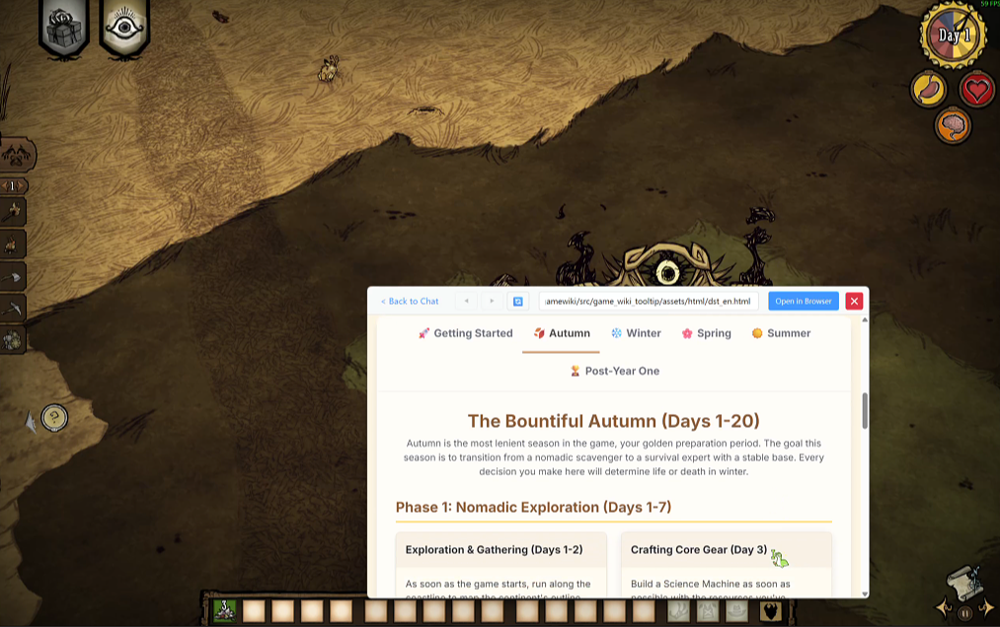

# GameWiki — Игровой помощник на базе ИИ

> **Умный игровой компаньон всегда под рукой** — вики-оверлей в реальном времени и база знаний ИИ для быстрых ответов во время игры


[](https://github.com/rimulu030/gamewiki/releases)

👉 **[English](README.md)** | **[中文说明](README.zh-CN.md)** | **[Быстрый старт](#-быстрая-установка)** | **[скачать последний релиз](https://github.com/rimulu030/gamewiki/releases/download/v0.1.1-beta/GameWikiAssistant_v0.1.1.zip)** | **[Discord](https://discord.gg/5HHjNdmYtm)**

## ✨ Зачем GameWiki?

Больше не нужно сворачивать игру! Получайте ответы, гайды и информацию из вики прямо в игре с помощью оверлея на базе ИИ.

### 🎯 Основные возможности

- **🔥 Одна горячая клавиша — все ответы** — нажмите `Ctrl+Q`, чтобы мгновенно вызвать вики или чат с ИИ, не выходя из игры
- **🤖 ИИ-эксперт по играм** — на базе Google Gemini с локальными базами знаний для умных вопросов и ответов

Для использования чата с ИИ нужна учётная запись Google и API-ключ Gemini из Google AI Studio.

_«Бесплатный уровень **Gemini API** предоставляется через API с более низкими [лимитами](https://ai.google.dev/gemini-api/docs/rate-limits#free-tier) для тестирования. Использование Google AI Studio **полностью бесплатно** во всех доступных странах» — [документация Gemini API](https://ai.google.dev/gemini-api/docs/pricing)_

## 📸 Скриншоты

- Использование как ИИ-помощника


**[Смотреть видео](https://www.youtube.com/watch?v=9QPJ6KVg7gE)**

- Быстрый доступ к вики




- Использование как веб-браузер


## 🚀 Быстрая установка

### Вариант 1: Портативная версия (рекомендуется)

[⬇️ Скачать последний релиз](https://github.com/rimulu030/gamewiki/releases/download/v0.1.1-beta/GameWikiAssistant_v0.1.1.zip)

1. Распакуйте ZIP-архив
2. Запустите `GameWikiAssistant.exe`
3. Настройте горячую клавишу и начинайте играть!

### 💡 Проверка ИИ без игры

Если хотите протестировать ИИ без установленной поддерживаемой игры, создайте новую папку и переименуйте её в название игры из нашей базы (например, "Don't Starve Together" или "Helldivers 2"). Установите фокус на эту папку, нажмите горячую клавишу — и можно общаться! Пример запроса: «How can I catch a rabbit?»

### Вариант 2: Запуск из исходников

```bash
# Клонирование и настройка
git clone https://github.com/rimulu030/gamewiki.git
cd gamewiki
pip install -r requirements.txt

# Настройка API-ключа для ИИ (опционально)
set GEMINI_API_KEY=your_key_here  # Windows

# Запуск
python -m src.game_wiki_tooltip
```

## 🎮 Поддерживаемые игры

### 🤖 Игры с ИИ (полная база знаний)

| Игра | Возможности |
|------|-------------|
| **HELLDIVERS 2** | Оружие, стратагемы, слабости врагов |
| **Elden Ring** | Предметы, боссы, гайды по билдам |
| **Don't Starve Together** | Крафт, персонажи, советы по выживанию |
| **Civilization VI** | Цивилизации, юниты, стратегии победы |

### 📖 Игры с поддержкой вики

Быстрый доступ к вики для более чем 100 игр: VALORANT, CS2, Monster Hunter, Stardew Valley и другие!

## 🔧 Настройка

### Первый запуск

1. **Горячая клавиша** — выберите удобную комбинацию (по умолчанию: `Ctrl+Q`)
2. **API-ключ** (опционально) — добавьте ключ Gemini для ИИ-функций
3. **Определение игры** — автоматически, просто запустите игру

### Дополнительные настройки

- Пользовательские комбинации горячих клавиш
- Язык (EN/ZH)
- Настройка источников вики
- Параметры распознавания голоса

## 📚 Документация

- **[Быстрый старт](docs/QUICKSTART.md)** — начать за 5 минут
- **[FAQ](docs/FAQ.md)** — частые вопросы и решения
- **[Сборка](docs/BUILD.md)** — сборка исполняемого файла
- **[Архитектура](docs/ARCHITECTURE.md)** — технические детали
- **[Документация модуля ИИ](src/game_wiki_tooltip/ai/README.md)** — подробности об ИИ-системе

## 🐛 Решение проблем

| Проблема | Решение |
|----------|---------|
| **Не срабатывает горячая клавиша** | Запуск от имени администратора / смена комбинации |
| **Игра не определяется** | Проверьте список поддерживаемых игр |
| **ИИ не отвечает** | Проверьте API-ключ в настройках |
| **Сайт не отображается** | Установите WebView2 Runtime (входит в пакет) |

Подробнее: [FAQ](docs/FAQ.md) или [сообщить об ошибке](https://github.com/rimulu030/gamewiki/issues).

## 🤝 Участие в разработке

Мы рады вкладу в проект:

- 🎮 Добавление поддержки новых игр и баз знаний — [как собрать новую базу знаний](src/game_wiki_tooltip/ai/README.md)
- 🐛 Исправление ошибок
- 📚 Улучшение документации
- Оптимизация проекта

## 📄 Лицензия

В связи с использованием PyQt6 распространяется под лицензией GPL3.0 — см. [LICENSE](LICENSE)

## 🙏 Благодарности

- **Google Gemini AI** — за интеллектуальные ответы
- **Игровые сообщества** — за контент вики и знания

## Контакты

- Weizhen Chu
- chu.weizhen04@gmail.com
- X: https://x.com/ChengXiang75007
---

<div align="center">

**⭐ Поставьте звёздочку, если проект полезен в ваших играх!**

[Сообщить об ошибке](https://github.com/rimulu030/gamewiki/issues) · [Discord](https://discord.gg/5HHjNdmYtm)

</div>
